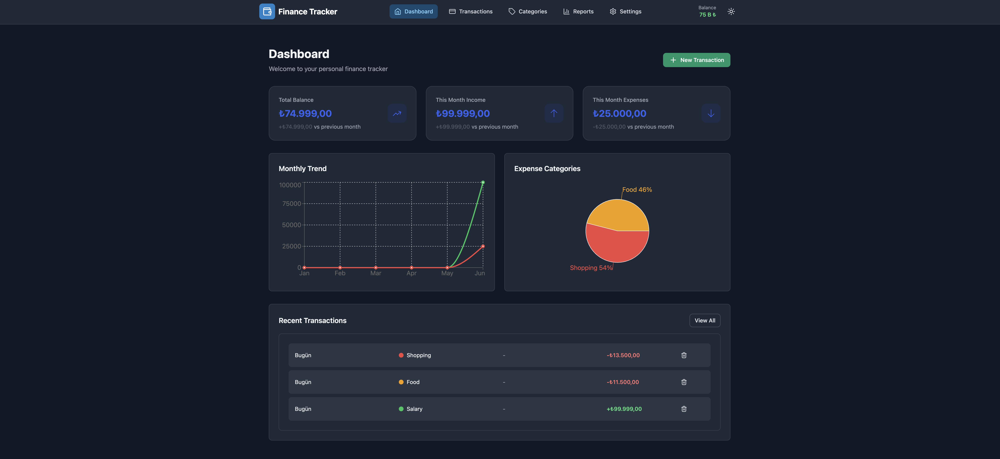
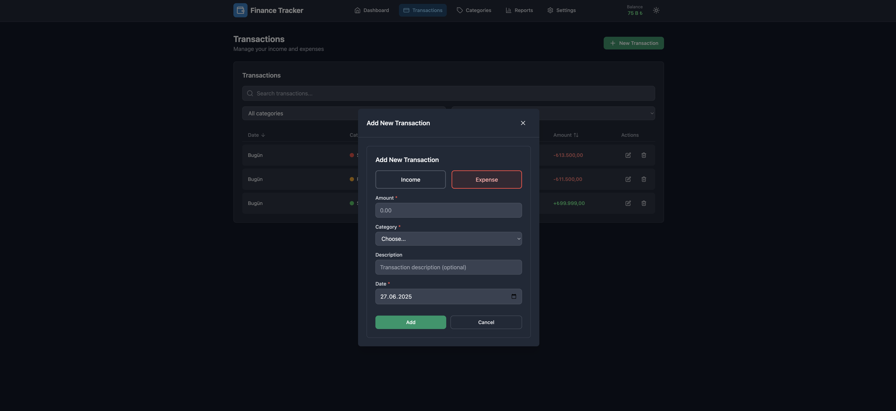
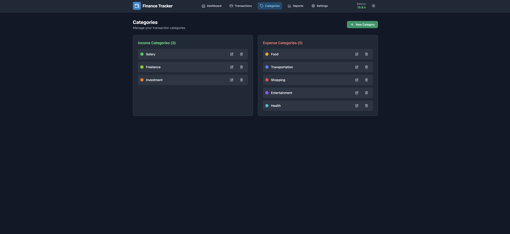
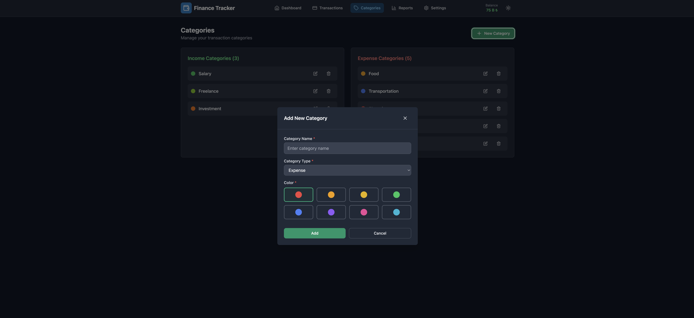
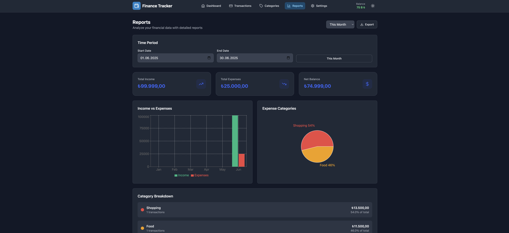
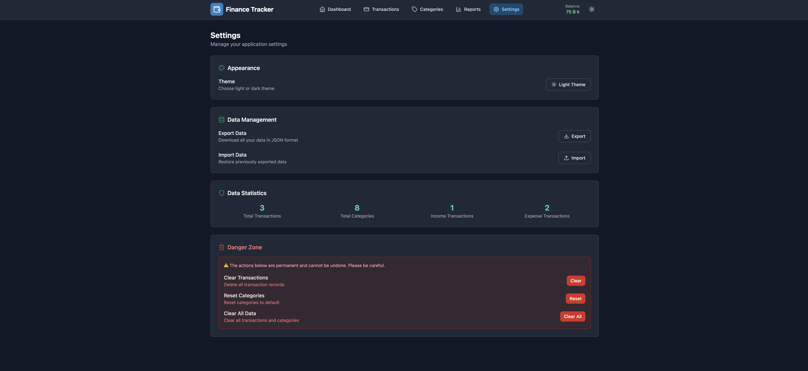

# Personal Finance Tracker

A modern, responsive personal finance tracking application built with React and Tailwind CSS.

## 🌟 Features

- **Transaction Management**: Add, edit, and delete income and expense transactions
- **Category Management**: Create and customize transaction categories with colors
- **Financial Reports**: View detailed charts and analytics
- **Dark/Light Theme**: Toggle between dark and light themes
- **Responsive Design**: Mobile-first design that works on all devices
- **Data Export/Import**: Backup and restore your financial data
- **Modern UI**: Clean, minimal design with smooth animations

## 🚀 Technologies

- **React 18** - Modern React with Hooks
- **React Router** - Client-side routing
- **React Hook Form** - Form management
- **Tailwind CSS** - Utility-first CSS framework
- **Recharts** - Chart and data visualization
- **Date-fns** - Date manipulation library
- **Lucide React** - Modern icon library
- **React Toastify** - Toast notifications
- **Vite** - Fast build tool
- **LocalStorage** - Data persistence

## 📱 Screenshots

### Dashboard (Light Theme)


### Dashboard (Dark Theme)


### Transactions Page



### Categories Management



### Reports & Analytics


### Settings Page


## 🛠️ Installation

1. Clone the repository:
```bash
git clone https://github.com/berkesasa/React-financetracker.git
cd React-financetracker
```

2. Install dependencies:
```bash
npm install
```

3. Start the development server:
```bash
npm run dev
```

4. Open your browser and visit `http://localhost:5173`

## 📦 Build

To build the project for production:

```bash
npm run build
```

## 🚀 Deployment

This project is configured for deployment on GitHub Pages:

```bash
npm run deploy
```

## 🎯 Usage

1. **Add Transactions**: Click the "New Transaction" button to add income or expenses
2. **Manage Categories**: Go to Categories page to create custom categories
3. **View Reports**: Check the Reports page for detailed financial analytics
4. **Export Data**: Use Settings page to backup your financial data
5. **Theme Toggle**: Switch between light and dark themes in the header

## 📊 Features Overview

### Dashboard
- Financial overview with key metrics
- Recent transactions list
- Monthly trend charts
- Category distribution

### Transactions
- Complete transaction history
- Search and filter capabilities
- Edit and delete transactions
- Income/expense categorization

### Categories
- Custom category creation
- Color-coded organization
- Income and expense categories
- Category management tools

### Reports
- Interactive charts and graphs
- Time period filtering
- Category breakdown analysis
- Export functionality

### Settings
- Theme customization
- Data export/import
- Clear data options
- Application statistics

## 📄 License

This project is licensed under the MIT License - see the [LICENSE](LICENSE.txt) file for details.

## 🙏 Acknowledgments

- [React](https://reactjs.org/) - JavaScript library
- [Tailwind CSS](https://tailwindcss.com/) - CSS framework
- [Recharts](https://recharts.org/) - Chart library
- [Lucide](https://lucide.dev/) - Icon library
- [Vite](https://vitejs.dev/) - Build tool
